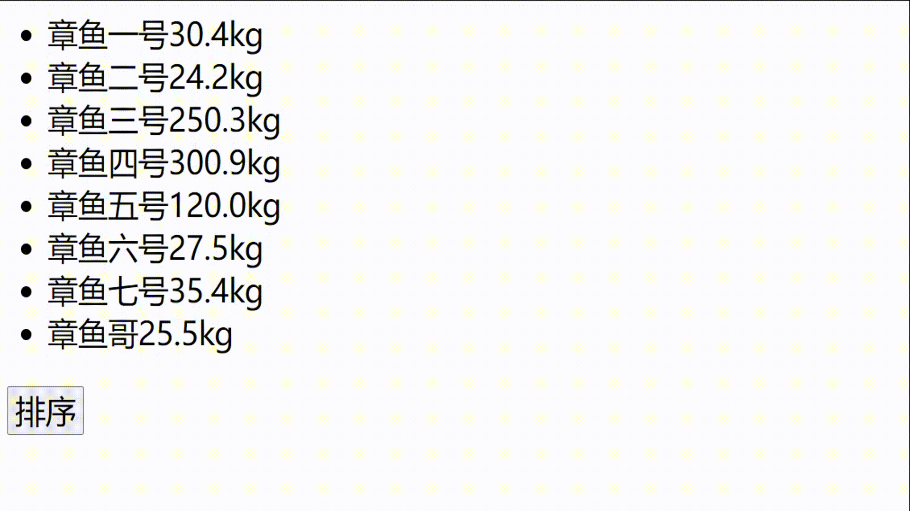

# JavaScript 入门与 DOM 基础操作

> 恭喜你来到了第二站！现在我们要学会让网页「活」起来，赋予它交互能力。在这一节中，我们将学习 JavaScript 的基础知识，以及如何使用 JavaScript 操作 DOM 元素。

## 学习目标

- 掌握 JavaScript 的基本语法
- 了解在 JavaScript 中操作 DOM 元素的方式
- 掌握如何使用 DOM API 获取页面元素、监听事件、修改元素内容属性等操作

## 学习提示

编程语言都是共通的。如果你之前学过其他编程语言，那么学习 JavaScript 会更加容易。如果你是刚开始接触编程，也不用担心，我们提供的学习资料会从基础开始，一步步带你学习。

如果你的校内课程有 C 语言课程，那么你可以参考 C 语言的学习经验，来学习 JavaScript。先学哪一个对学习另外一个都是有帮助的。

在学习前端的过程中，如果遇到不会的东西，可以去 [MDN Web Docs](https://developer.mozilla.org/zh-CN/) 上搜索一下试一试，大部分问题都能在这里找到答案。

## 概念扫盲

> 以下概念了解即可，无需死记硬背。

- JavaScript 是一种脚本编程语言，它可以在网页上实现复杂的功能，网页展现给你的不再是简单的静态信息，而是实时的内容更新——交互式的地图、2D/3D 动画、滚动播放的视频等等 —— JavaScript 就在其中。

## 学习资料

当遇到不懂的地方时，首先要尝试自己解决，可以去使用百度、谷歌等搜索引擎寻求帮助。具备**利用搜索引擎解决自己问题**的能力非常非常重要！如果还是不会，可以直接在群里提问。

### JavaScript

- [什么是 JavaScript](https://developer.mozilla.org/zh-CN/docs/Learn/JavaScript/First_steps/What_is_JavaScript)，MDN Web Docs。
  - 重点关注「它到底可以做什么？」一节，其次关注「怎样向页面添加 JavaScript？」和「注释」。
  - 这个页面上的内容很多，无需全部理解。我们只需要了解 JavaScript 大致在干什么就行了，如果遇到不懂的地方，可以先跳过。
- 选读：[JavaScript 初体验](https://developer.mozilla.org/zh-CN/docs/Learn/JavaScript/First_steps/A_first_splash)，MDN Web Docs。
  - 这个页面上有一份简单的 JavaScript 代码示例，可以先看一下，不要求全部理解。
  - 在「示例 —— 猜数字游戏」一节中，还给出了解读任务需求的方法指引，这对以后处理各种需求会有帮助。
- [JavaScript 基本语法](https://wangdoc.com/javascript/basic/grammar)，网道。
  - 这个页面上梳理了 JavaScript 的基本语法，如果有其他编程语言基础的话，应该很快就能了解 JavaScript 的基本语法。
  - 如果感觉这个页面的介绍太简略，看不懂的话，这里有一些详细的说明：
    - [变量](https://developer.mozilla.org/zh-CN/docs/Learn/JavaScript/First_steps/Variables)
    - [数字和操作符](https://developer.mozilla.org/zh-CN/docs/Learn/JavaScript/First_steps/Math)
    - [字符串](https://developer.mozilla.org/zh-CN/docs/Learn/JavaScript/First_steps/Strings)、[字符串的相关方法](https://developer.mozilla.org/zh-CN/docs/Learn/JavaScript/First_steps/Useful_string_methods)
    - [数组](https://developer.mozilla.org/zh-CN/docs/Learn/JavaScript/First_steps/Arrays)
    - [条件语句](https://developer.mozilla.org/zh-CN/docs/Learn/JavaScript/Building_blocks/conditionals)
    - [循环语句](https://developer.mozilla.org/zh-CN/docs/Learn/JavaScript/Building_blocks/Looping_code)
    - [函数](https://developer.mozilla.org/zh-CN/docs/Learn/JavaScript/Building_blocks/Functions)
- [查找并解决 JavaScript 代码的错误](https://developer.mozilla.org/zh-CN/docs/Learn/JavaScript/First_steps/What_went_wrong)，MDN Web Docs。
  - 这个页面上介绍了如何解读 JavaScript 代码的报错提示。
- [数据类型](https://wangdoc.com/javascript/types/)，网道。
- [数据类型转换](https://wangdoc.com/javascript/features/conversion)，网道。
- [console 对象与控制台](https://wangdoc.com/javascript/features/console)，网道。
  - 只需要掌握 `console.log` 的用法即可，其他的不必深究。
- [Date 时间库](https://wangdoc.com/javascript/stdlib/date.html)，网道。

### DOM API

在这个阶段中，我们将会学到一些基础的 DOM 操作，更深层次的内容将会在后续的学习中逐渐展开。

- [API 是什么？](https://developer.mozilla.org/zh-CN/docs/Learn/JavaScript/Client-side_web_APIs/Introduction)
  - 大致了解即可。
  - 链接的标题跟实际页面的标题有出入，因为笔者觉得这篇文章的科普性质更强一些。
- 获取页面元素的三种主要途径
  - [document.getElementById()](https://developer.mozilla.org/zh-CN/docs/Web/API/Document/getElementById)
  - [document.getElementsByTagName()](https://developer.mozilla.org/zh-CN/docs/Web/API/Element/getElementsByTagName)
  - [document.getElementsByClassName()](https://developer.mozilla.org/zh-CN/docs/Web/API/Document/getElementsByClassName)
- [Element 对象](https://wangdoc.com/javascript/dom/element)，网道。
  - 上面获取的元素就会以 Element 对象的形式返回。
  - 实际上会基于 Element 对象派生出很多其他的对象，比如 `HTMLInputElement` `HTMLDivElement` 等，这些做一些了解即可，每个对象都有自己的一些特殊属性和方法。
  - 重点关注 `attributes` `className` `classList` `innerHTML` `innerText` `style` 等属性以及其相关方法。
- 事件监听器
  - 提示：不要再用 `onclick` `onsubmit` 这种老掉牙的方式绑定事件了，直接看使用 `addEventListener` 的教程吧！
  - [addEventListener()](https://developer.mozilla.org/zh-CN/docs/Web/API/EventTarget/addEventListener)
    - 常见事件：`click` `scroll` `submit` `change` `input` `keydown` `keyup` 等（根据英文应该能看出来是什么操作触发的）。
  - [removeEventListener()](https://developer.mozilla.org/zh-CN/docs/Web/API/EventTarget/removeEventListener)
  - [Event 对象](https://developer.mozilla.org/zh-CN/docs/Web/API/Event)
    - 实际上会基于 Event 对象派生出很多其他的事件对象，比如 `MouseEvent` `KeyboardEvent` 等，这些做一些了解即可。
    - 用的比较多的有 `target`、`currentTarget` `preventDefault` `stopPropagation` 等属性和方法。

## 作业

作业不可以修改模板中的代码内容，只能在 `<script>` 标签内补全相应代码。

### 一

请基于 [demo1.html](./2/demo1.html) 进行修改，完成以下任务：

1. 页面上的时间每秒更新一次。
2. 鼠标移入 `#blue` 的时候 暂停时间的更新，并且有边框放大效果。
3. 鼠标移出 `#blue` 的时候 继续时间的更新，CSS 样式还原。
4. 点击定格按钮，`#red` 里面显示点击时候的时间。

效果图：

### 二

请基于 [demo2.html](./2/demo2.html) 进行修改，并按照文件中的要求和效果图完成任务。

效果图：

### 三

请基于 [demo3.html](./2/demo3.html) 进行修改，并按照文件中的要求和效果图完成任务。

效果图：

### 提交方式

请将代码提交至 [west2-online-reserve/collection-frontends](https://github.com/west2-online-reserve/collection-frontends)，提交方法可以参考该仓库中的说明。
